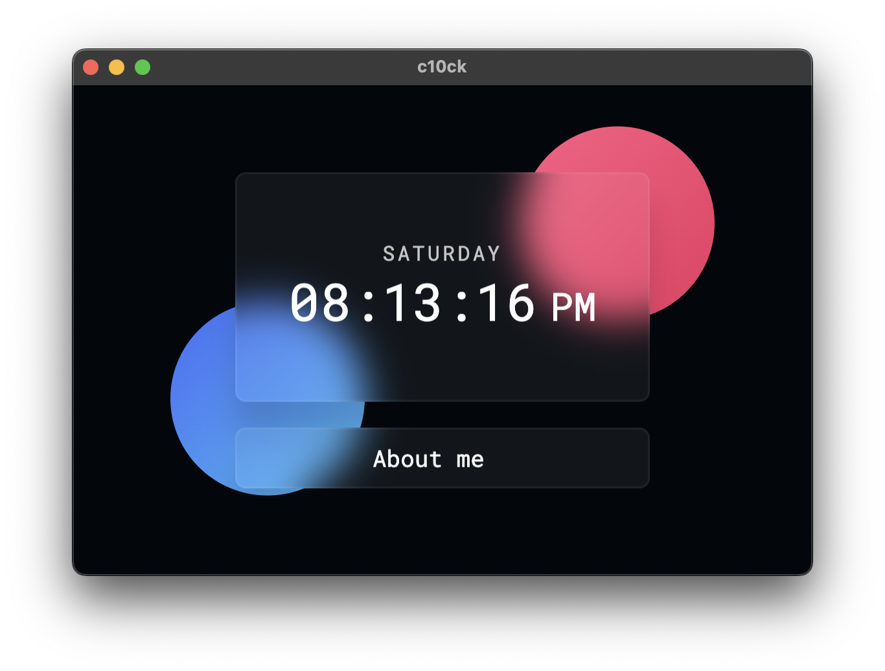

# cl0ck App

## Description

My PWA app is a simple web application that displays the current time and date.

## Features

- Displays the current time and date in a user-friendly format.
- Built using HTML, CSS, and JavaScript.
- Progressive Web App (PWA) that can be installed on mobile devices and desktops.
- Offline support using service workers.
- Responsive design that works well on different screen sizes.

## Screenshot

## How to Use

1. Open the app in a web browser.
2. The app will automatically display the current time and date.
3. You can interact with the app to view the time and date in different formats or customize the display.
4. Install the app on your mobile device or desktop for offline access (if supported).

## Technologies Used

- HTML
- CSS
- JavaScript
- Service Workers (for offline support)

## Roadmap

- Add additional features such as time zone selection, alarms, and notifications.
- Improve the user interface and design.
- Optimize performance for slower devices or network conditions.

## Feedback and Contributions

Feedback and contributions are welcome! Please report any issues or suggestions on the [GitHub repository](https://github.com/Fastiraz/cl0ck/).

## License

This app is released under the [MIT License](LICENSE).

